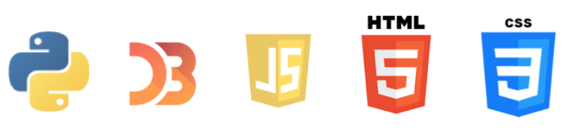
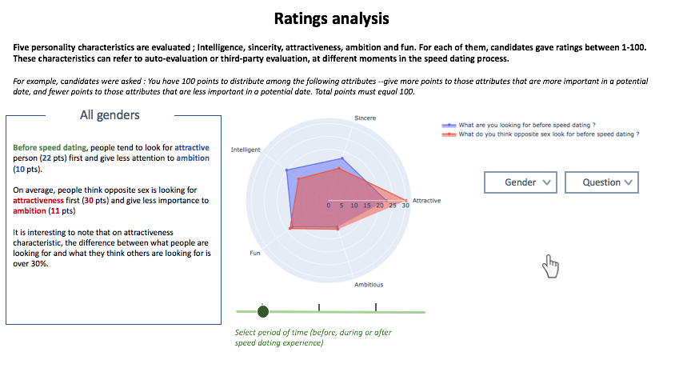
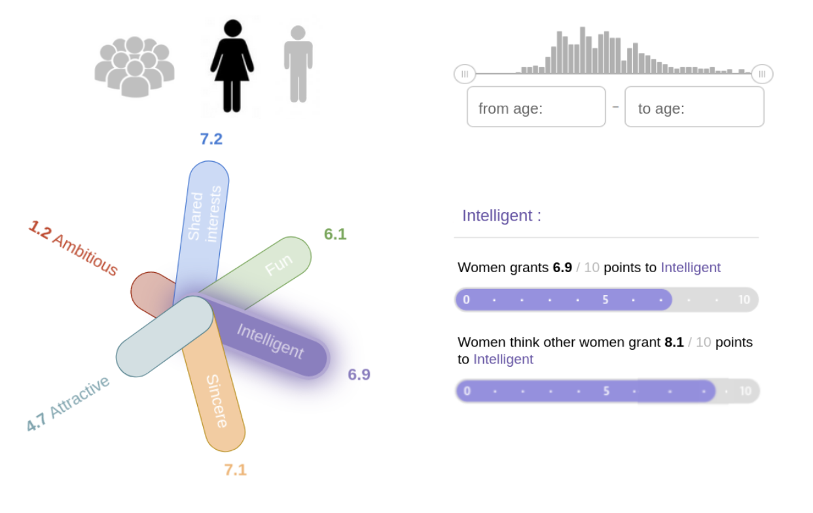
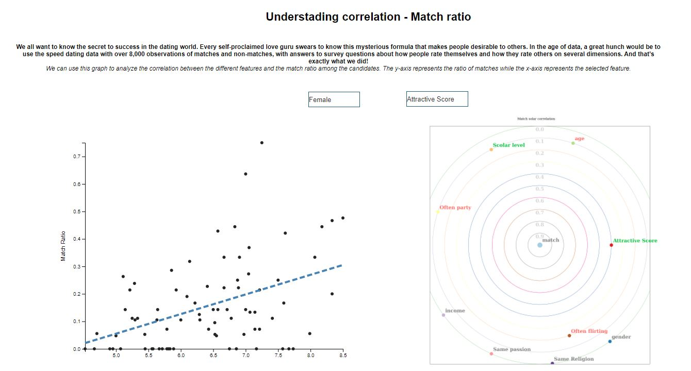

# DataVisualization - Speed Dating analysis 

_Contributors : Antoine Boulat, Simon Delarue, Mohammed El Yaagoubi, Mathias Nourry, Lingli Zhan_ 

Check the poster of the project [here](https://github.com/simondelarue/DataVisualization/tree/main/milestones/Poster.pdf) !

**Table of contents**  

0. [Usage](#Usage)   
1. [Project description](#Description)   
    1.1 [Data](#Data)  
    1.2 [Environment](#Env)  
2. [Designs](#Designs)  
    2.1 [Ratings analysis](#Ratings)  
    2.2 [Evolution of ratings with regard of personal characteristics](#charac)  
    2.3 [Match analysis](#Match)  

## 0. Usage <a class="anchor" id="Usage"></a>  

To run the web application please follow instructions (command lines) below to :  
* clone this Github repo and move to the cloned directory  
* launch application script  
* go to `http://127.0.0.1:5000/ `  

``` system
$ git clone https://github.com/simondelarue/DataVisualization
$ cd DataVisulization/webapp
$ python3 app.py
```

## 1 Project description <a class="anchor" id="Description"></a>  

### 1.1 Data <a class="anchor" id="Data"></a>  

In this **Datavisualization project**, we analyse the [Speed Dating dataset](https://flowingdata.com/2008/02/06/speed-dating-data-attractiveness-sincerity-intelligence-hobbies/).  

The dataset contains 8379 entries for 195 variables. Yet, data is missing for almost 26% of the whole dataset (or is non relevant to be filled - for example if the candidates had to choose between specific items to fill). 

In the data, we have got information about candidates from all around the world, like gender, age, background (studies) but also about what they expect from the speed-dating meeting, i.e their goal. Finally, for each candidate we have the answers about questionnaires that were given to them, regarding their feelings about themselves, the attributes they put in their scorecards about the candidate they met and feeling about the event. Most of this information is already encoded as numerical values. A smaller part of the variables are still qualitative.

We have 551 unique candidates for the whole dataset, 49.94% female and 50.06% male. Data has been gathered on 21 waves of speed-dating.  

### 1.2 Environment <a class="anchor" id="Env"></a>  

We used the following technologies for this project 

<p align="center">
    
</p>


## 2 Designs <a class="anchor" id="Designs"></a>   

For the purpose of the project, we first designed **sketches** of the different visualizations we wanted to implement. On this basis, we developped the final web application that gathers all the designs.  

In the following sections, we present sketches as well as implemented designs.

### 2.1 Ratings analysis  <a class="anchor" id="Ratings"></a>  

It is quite usual that - when asked to judge and rate ourselves on subjective items such as attractiveness or fun - our own perception is different from the one proposed by a third-party. Yet, is this hypothesis just a feeling or can we measure this divergence ? 
This visualization proposes to give insight to answer this question, by providing the user with an interactive analysis based on ratings fulfilled by candidates before, during and after the speed dating exercise.

For this study, we propose a martini-glass based approach, meaning that the user is given a global idea about the answer, with a small analysis provided, and is then invited to interact with the tool in order to find answers to more precise questions that could eventually arise during the first part.

The general overview of the intial sketch desing was as following 

<p align="center">
    
</p>  

Using **python** for data preprocessing and **D3.js** to build radar chart and add interactivity, the final visualization tool looks like the following for the user.

This tool gives the user the ability to filter data on different dimensions :  
* Gender  
* Question asked to candidate  

Thanks to a **time slider** the user can get an intuition of the evolution of candidates answers on topic such as "what they look for" or "how they think they measure up".  

On the left of the tool, a small information textbox allows the user to understand how to actually read the radar chart, and provides a small analysis of the data initially displayed. For this information box, **match on content** is used, help the user recognize which features are analysed.

<p align="center">
    
</p> 


### 2.2 Evolution of ratings with regard of personal characteristics  <a class="anchor" id="Charac"></a>  

This data may be interesting to a more specialised audience such as sociologists and/or psychologists, that’s the reason why it is on a separate webpage, and also because of a change of approach.

After the first part using the martini-glass based approach, this section, as the user is an expert, **drill-down** approach is preferred.

Having showed the difference between what people are looking for in the opposite sex and what people think the fellow men/women are looking for in the opposite sex, our goal is to provide more detailed information for all those who are interesed in having a more in-depht anaysis. A short list of questions that our users may be interested in are:
Do the participants think they have very different rankings of the 6 criteria?
Are these differences significant? Between men and women ?
How does it change with age?

Our objective is to provide elements so that the user can make up its own mind.
That is the reason why we are providing only figures from the dataset, not any interpretation/assertion. We use a design more **reader-driven approach**. Sketch 2 supports tasks such as psychological hypotheses formation, participants profiling …

The general overview of this second sketch desing was as following

<p align="center">
    
</p>

Using python for data preprocessing and D3.js to build flower diagram and add interactivity, the final visualization tool looks like the following for the user.

<p align="center">
    
</p>

This tool gives the user the ability to filter data on different dimensions :

- Gender
- Age range
- Attributes

The implemented design is very similar to what was designed in the first place, with 2 exceptions correcting identified shortcomings:

- On the upper left, the **gender selector** doesn’t contain anymore “All”.
  The choice is limited to female or male icone. We chose to remove this option because of the size of our dataset. Actually, we have only 551 unique candidates. If the age range is too narrow, the possibility of having only women or only men in the selected population is very high and thus resulting in misleading information.

- Ticket on the lower right has been replaced by a **text box**.
  Before the change, only the second bar visualization provides information that is not already displayed in the flower diagram, i.e “ how the selected population think most of their fellow men/women have rated the criterion”.<br> This change has allowed us to have more space, thus enabling us to add more valuable information. Indeed, not only users know what is the rating for the selected population on the chosen criteria, but also several significant static information are added.</br>
  
  
### 2.3 Match analysis  <a class="anchor" id="Match"></a>  

We all want to know the secret to success in the dating world. Every self-proclaimed love guru swears to know this mysterious formula that makes people desirable to others. In the age of data, a great hunch would be to use the speed dating data with over 8,000 observations of matches and non-matches, with answers to survey questions about how people rate themselves and how they rate others on several dimensions. And that’s exactly what we did !

On the left, you can find a simple scatter plot with a choice of feature to plot according to the match ratio (each point represents one of the subjects of the study). For this first visualisation, we use D3 (scatter.js) for the scatter plot and our own regression function for the linear trend.

On the right, the solar correlation map represents the level of correlation of the different features with the match ratio. This diagram allows you to easily observe which features are highly correlated with the match ratio. 

This approach is both sober and simple so that the tool is as accessible as possible.
You can found the following features extract from the python file :
- int_corr, quantifying the degree of correlation between the passions of each of the participants,
- attr_o, the attractiveness score of the candidate based on the scores of other participants
- mn_sat, the candidate grade of the exam
- income, the average price of real estate in the area of residence which roughly represents the person's salary
- imprelig, the importance score of a subject for his partner to have the same religion
- go_out which represents the frequency of partying
- date which represents the subject's dating frequency

<p align="center">
    
</p>

You can select one of these features and observe the impact of that feature on the match ratio using a drop-down menu. You can also create a dichotomy between men and women.
